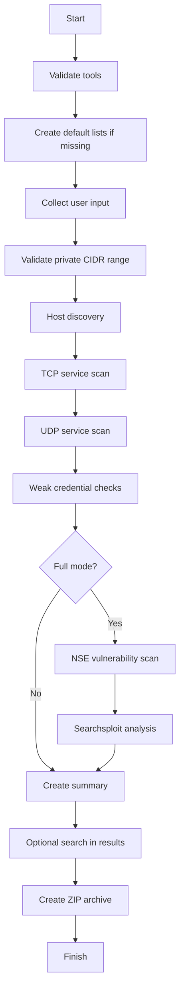

# VULNER - Automated Network Vulnerability Scanner

VULNER is a Bash-based penetration testing support tool for authorized lab and internal network assessments. It automates host discovery, TCP and UDP service scanning, service version detection, weak credential checks, vulnerability mapping, result searching, and ZIP-based evidence collection.

> Legal scope: Use this tool only on networks you own or where you have explicit written permission to test.

## Project Highlights

- Interactive network scanner for local/private lab ranges
- Basic and Full scan modes
- Host discovery with Nmap
- TCP service detection with version fingerprinting
- UDP scan of common UDP ports
- Weak credential checks for SSH, FTP, TELNET, and RDP
- Full mode with Nmap NSE vulnerability scripts
- Searchsploit mapping based on Nmap XML output
- Search inside generated results
- Automatic ZIP archive creation
- Self-contained default `user.lst` and `password.lst` generation
- Structured Bash functions for maintainability

## Modes

| Mode | Description |
|---|---|
| Basic | Host discovery, TCP scan, UDP scan, service version detection, weak credential checks, summary, ZIP |
| Full | Everything in Basic mode plus Nmap NSE vulnerability scan and Searchsploit analysis |

## Architecture



## Requirements

Tested on Kali Linux. Required tools:

- bash
- python3
- nmap
- hydra
- searchsploit
- zip
- grep
- awk
- sed
- tee

Install dependencies on Kali or Debian-based systems:

```bash
sudo apt update
sudo apt install -y nmap hydra exploitdb zip python3
```

Or use the helper script:

```bash
chmod +x scripts/install_kali_dependencies.sh
./scripts/install_kali_dependencies.sh
```

## Quick Start

```bash
chmod +x vulner.sh
./vulner.sh
```

Example answers during execution:

```text
Enter network to scan in CIDR format, example 192.168.47.0/24: 192.168.47.0/24
Enter output directory name, example basic_scan: basic_scan
Choose scan mode [Basic/Full]: Basic
Use custom password list? [y/N]: N
Do you want to search inside the results? [y/N]: N
```

Show help:

```bash
./vulner.sh --help
```

## Output Structure

```text
results/
└── basic_scan_basic_YYYYMMDD_HHMMSS/
    ├── 01_host_discovery.gnmap
    ├── 01_host_discovery.nmap
    ├── 01_host_discovery.xml
    ├── 02_tcp_services.gnmap
    ├── 02_tcp_services.nmap
    ├── 02_tcp_services.xml
    ├── 03_udp_services.gnmap
    ├── 03_udp_services.nmap
    ├── 03_udp_services.xml
    ├── hydra_results/
    ├── live_hosts.txt
    ├── run.log
    └── summary.md
```

Full mode also creates:

```text
04_nse_vuln.gnmap
04_nse_vuln.nmap
04_nse_vuln.xml
05_searchsploit.txt
```

## Example Finding

A controlled lab run identified an FTP service with weak credentials:

```text
Host: 192.168.47.136
Service: FTP
Username: ftp
Password: admin
```

This finding is included only as a lab demonstration and must not be used against unauthorized systems.

## Safety Controls

- The script validates CIDR input before scanning.
- The script restricts scans to private network ranges.
- The built-in password list is intentionally small and intended for lab validation.
- The tool displays each stage during execution and stores logs for auditability.

## Repository Structure

```text
.
├── vulner.sh
├── README.md
├── LICENSE
├── .gitignore
├── CHANGELOG.md
├── SECURITY.md
├── docs/
│   ├── architecture.md
│   ├── usage.md
│   ├── safety-and-scope.md
│   └── project-summary.md
├── examples/
│   ├── basic-mode-demo.md
│   ├── full-mode-demo.md
│   └── sample-summary.md
└── scripts/
    └── install_kali_dependencies.sh
```

## Screenshots

Recommended screenshots for the repository:

1. Environment preparation
2. Basic scan evidence
3. Full scan evidence
4. Search inside results
5. Generated result files

Place screenshots under `assets/` and reference them from this README if you want a visual portfolio version.

## Disclaimer

This project is for defensive security education, internal validation, and authorized lab environments only. Do not run it against public IP addresses, third-party systems, or networks without explicit permission.
