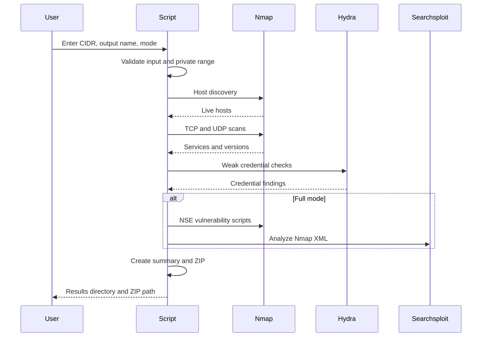

# Architecture

VULNER is organized as a Bash automation script built from small functions. Each function owns one step of the scanning workflow.

## Functional Blocks

| Function | Purpose |
|---|---|
| `ensure_default_lists` | Creates default user and password lists if missing |
| `check_tools` | Verifies required tools are installed |
| `get_user_input` | Collects network, output name, mode, and password list selection |
| `validate_network` | Validates CIDR syntax |
| `require_private_network` | Restricts scanning to private network ranges |
| `run_host_discovery` | Discovers live hosts |
| `run_tcp_scan` | Detects open TCP services and versions |
| `run_udp_scan` | Detects common UDP services |
| `run_weak_credentials` | Runs weak credential checks against supported login services |
| `run_nse_vulnerability_scan` | Runs Nmap vulnerability scripts in Full mode |
| `run_searchsploit_analysis` | Maps Nmap XML results to Exploit-DB entries |
| `create_summary` | Creates a Markdown summary report |
| `search_inside_results` | Allows keyword search inside generated files |
| `zip_results` | Compresses all results into a ZIP archive |

## Workflow

